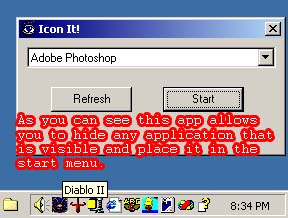



## Icon It\!  \(updated:06\.04\.02\)

### Description

Program Iconizes A Visible Window into the start menu.

I updated this (06.04.02). it now puts the Hidden apps icon and i fixed a few bugs. i have a screenshot now so you can see what it does without downloading anything.
 
### More Info
 

             |
---                |---
**Submitted On**   |2002-06-04 21:11:14
**By**             |[Billy Conner](https://github.com/Planet-Source-Code/PSCIndex/blob/master/ByAuthor/billy-conner.md)
**Level**          |Intermediate
**User Rating**    |5.0 (10 globes from 2 users)
**Compatibility**  |VB 6\.0
**Category**       |[Complete Applications](https://github.com/Planet-Source-Code/PSCIndex/blob/master/ByCategory/complete-applications__1-27.md)
**World**          |[Visual Basic](https://github.com/Planet-Source-Code/PSCIndex/blob/master/ByWorld/visual-basic.md)
**Archive File**   |[Icon\_It\!\_\_90366642002\.zip](https://github.com/Planet-Source-Code/billy-conner-icon-it-updated-06-04-02__1-6389/archive/master.zip)

### API Declarations

alot

